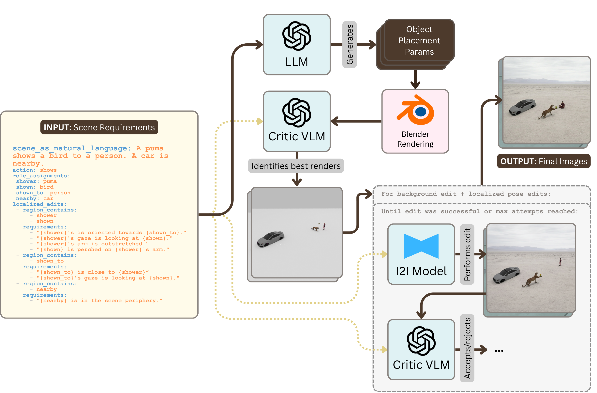

# PoseBlend

PoseBlend: Compositional Action Scenes via Critic-Gated Localized Pose Editing of Blender Renders

## How does it work?



## Running PoseBlend

```bash
# Run the pipeline (headless, no GUI)
python main.py

# Run with real-time GUI
python main.py --gui

# Use a specific scene spec and/or config
python main.py --scene inputs/scenes/puma_shows_bird_to_person_car_nearby.yaml
python main.py --config inputs/configs/simple.yaml --scene inputs/scenes/some_scene.yaml

# Use a custom port for the GUI server (default: 8420)
python main.py --gui --port 9000
```

## Viewing Past Runs

```bash
# View a previous run's results in the GUI (by run directory)
python main.py --view outputs/20260214_224402
```

## Rebuilding the GUI

The backend serves the GUI from `gui/dist/`, so after making changes to the Svelte
frontend, you need to rebuild:

```bash
cd gui && npm run build && cd ..
```

To do a full reset (reinstall deps + rebuild):

```bash
cd gui && npm install && npm run build && cd ..
```

After rebuilding, hard-refresh the browser (`Cmd+Shift+R` / `Ctrl+Shift+R`) or close and
reopen the tab to ensure the new assets are loaded.

## Inputs

To run, PoseBlend requires three things:

1. An input scene specification
2. A configuration of hyperparameters
3. A registry/repository of usable Blender objects

## Alternative to Blender Renders: Generating Starting Images with T2I Models

PoseBlend can optionally skip Blender rendering entirely and instead bootstrap edit
chains from text-to-image (T2I) generated starting images. This is useful as a baseline
for measuring the value of the Blender rendering stage, or as a lightweight alternative
when Blender objects are unavailable.

To enable T2I mode, set `t2i_model` in the config YAML to a registered T2I model name:

```yaml
t2i_model: "fal-ai/flux-2"
```

When `t2i_model` is set, PoseBlend will:

1. Use an LLM to generate a T2I prompt describing the scene's objects in a plausible
   spatial arrangement (neutral poses, no action depicted)
2. Generate `num_edit_chains` starting images with the T2I model
3. Skip the background edit (Edit 0) and go straight to localized pose edits

A ready-to-use config is provided at `inputs/configs/t2i_baseline.yaml`:

```bash
python main.py --config inputs/configs/t2i_baseline.yaml --scene inputs/scenes/horse_rides_astronaut.yaml
```

## 3D Object Attributions

3D object models are from [sketchfab.com](https://sketchfab.com) and are under creative common or creative commons attribution licenses.

| Object | Attribution |
|--------|-------------|
| Chandalier | [708052 Elegante Osgona chandelier by LIGHTSTAR GROUP](https://sketchfab.com/3d-models/708052-elegante-osgona-chandelier-c728438359de4bd29ce3585f9b5358be#download) |
| Goal | [porteria futbol soccer goal by darineroar](https://sketchfab.com/3d-models/porteria-futbol-soccer-goal-39ba53e66e9244b88b4e58dcc81fdf9fd) |
| Athlete | [Basketball Player - AI Generated by ScanTasticWorld](https://sketchfab.com/3d-models/basketball-player-ai-generated-f2b3d51b27f241fc955606b2c949eeff) |
| Basketball Hoop | [Basketball Hoop V01 by Visual Vertigo](https://sketchfab.com/3d-models/basketball-hoop-v01-252017366b7f404d941ce6fd7334a57f) |
| Chandelier | [Chandelier from Poly by Google](https://sketchfab.com/3d-models/chandelier-from-poly-by-google-202cbb2a22ea4dda80160ec89a77dc39) |
| Horse | [Horse by Chenzoss](https://sketchfab.com/3d-models/horse-ce01ec79d19241e8995bddf17a7fd7fa) |
| Astronaut | [LOW POLY ASTRONAUT by Colin.Greenall](https://sketchfab.com/3d-models/low-poly-astronaut-a0858f7876e1432b94c4c0571ee4e17a) |
| Cat | [Orange Cat by ilhamtr](https://sketchfab.com/3d-models/orange-cat-2b722183b60e4fcfbe3c2263536d2fa6) |
| Mouse | [Lab Mouse by Just8](https://sketchfab.com/3d-models/lab-mouse-b8817926c0c74e43b6664a3fb0f76960) |
| Pottery Wheel | [Pottery Wheels by Chih.Leung](https://sketchfab.com/3d-models/pottery-wheels-6035e687f23e428e8dcfe1a311ac1119) |
| Clay Pot | [[Low-Poly] Clay Pot by KKarlie](https://sketchfab.com/3d-models/low-poly-clay-pot-ca90a4a5cc804e0985e33d39e12cd809) |
| Woman | [Woman Walking by Arion Digital](https://sketchfab.com/3d-models/woman-walking-7fdd3ab66966442db81cc8a7f4f741aa) |
| Bee | [Bee | oxterium by 7runes_design](https://sketchfab.com/3d-models/bee-oxterium-9762197f02f84fceb8c0665e00961fe3) |
| Flower in Pot | [Flower in a pot by Dmytro Nikonov](https://sketchfab.com/3d-models/flower-in-a-pot-ff5c136753214751904c65a92056ce02) |
| Matador | [Matador by Thunk3D](https://sketchfab.com/3d-models/matador-819ada91de1943e4a11f7f8af7cba9dd) |
| Anthropomorphic Bull | [Bull by anderlenolan](https://sketchfab.com/3d-models/bull-379cea75232f48fb83c9fe60ad3ec9b3) |
